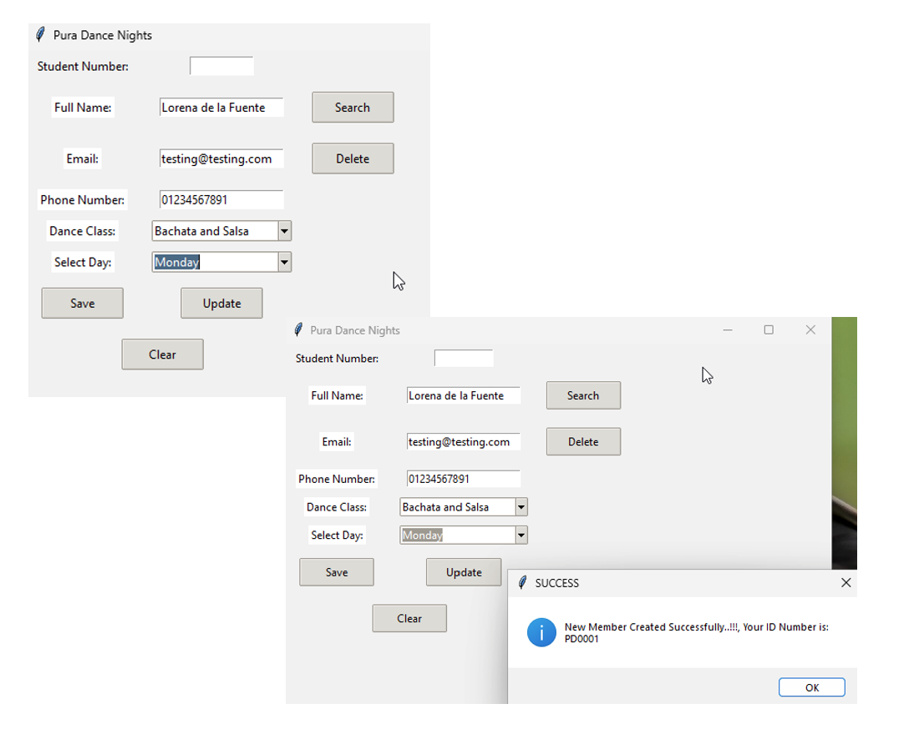
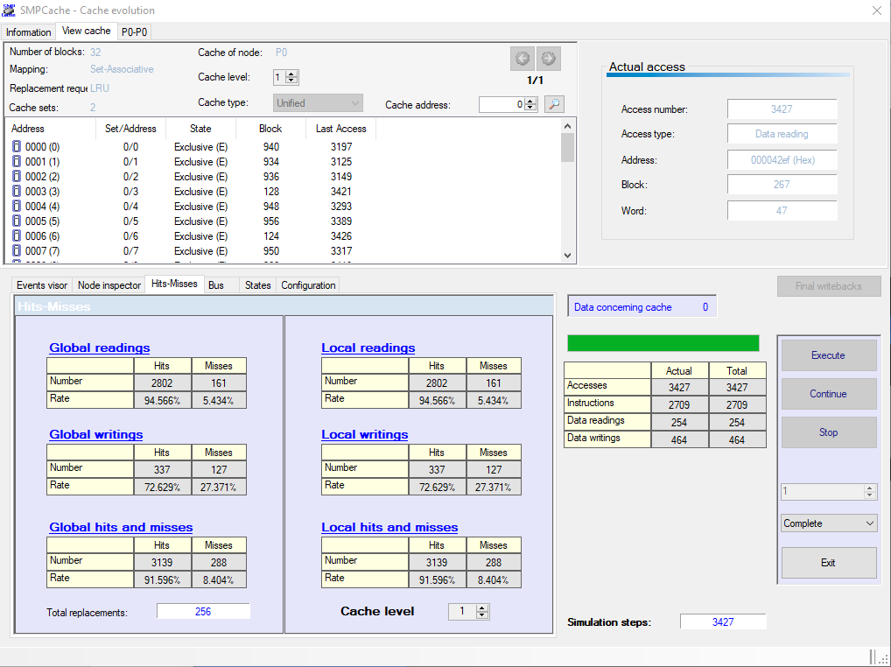

# Cache and Database Projects

This repository contains two major academic projects developed as part of the *Computer Systems and Software Engineering* module:

1. **Cache System Performance Evaluation** using the SMPCache Simulator
2. **Pura Dance Student Registration System** using Python, SQLite, and Tkinter

---

## 📁 Project 1: Cache System Performance Evaluation

### Overview
This project evaluates the performance of cache memory in symmetric multiprocessor systems using the SMPCache Simulator. Various configurations and protocols (MSI, MESI, DRAGON) were tested, and performance metrics such as hit/miss rates were analyzed.

### Tools Used
- SMPCache Simulator
- Windows 11 (via UTM)
- Excel/Manual calculation for metrics

### Key Outcomes
- Detailed comparison of coherence protocols
- Analysis of bus traffic and local/global hit rates
- Insights into system bottlenecks and optimization opportunities

📄 Full report available [here](SMPCache_Simulator_Project/documentation/SMP%20CACHE%20SIMULATOR.pdf)
📊 See simulation outputs and graphs in the [results folder](SMPCache_Simulator_Project/images)
---

## 📁 Project 2: Pura Dance Registration System

### Overview
An intuitive student registration system for a dance school offering Bachata, Salsa, Lady Styling, and Couple Team classes. Includes GUI for managing students and schedules.

### Technologies
- Python
- SQLite
- Tkinter

### Features
- Add, search, update, and delete student records
- Automatic student ID generation
- Dynamic class and weekday selection
- Validation and user-friendly feedback

📄 [See screenshots and UML in the diagrams folder](Pura_Dance_Registration_System/diagrams)

---

## 👨‍🎓 Author
**Edinson Alva Diaz**  
Student ID: 4319040  
Module: EEE_6_CSE – Computer Systems and Software Engineering  
Lecturer: Ya Bao
